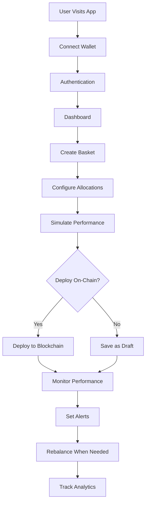
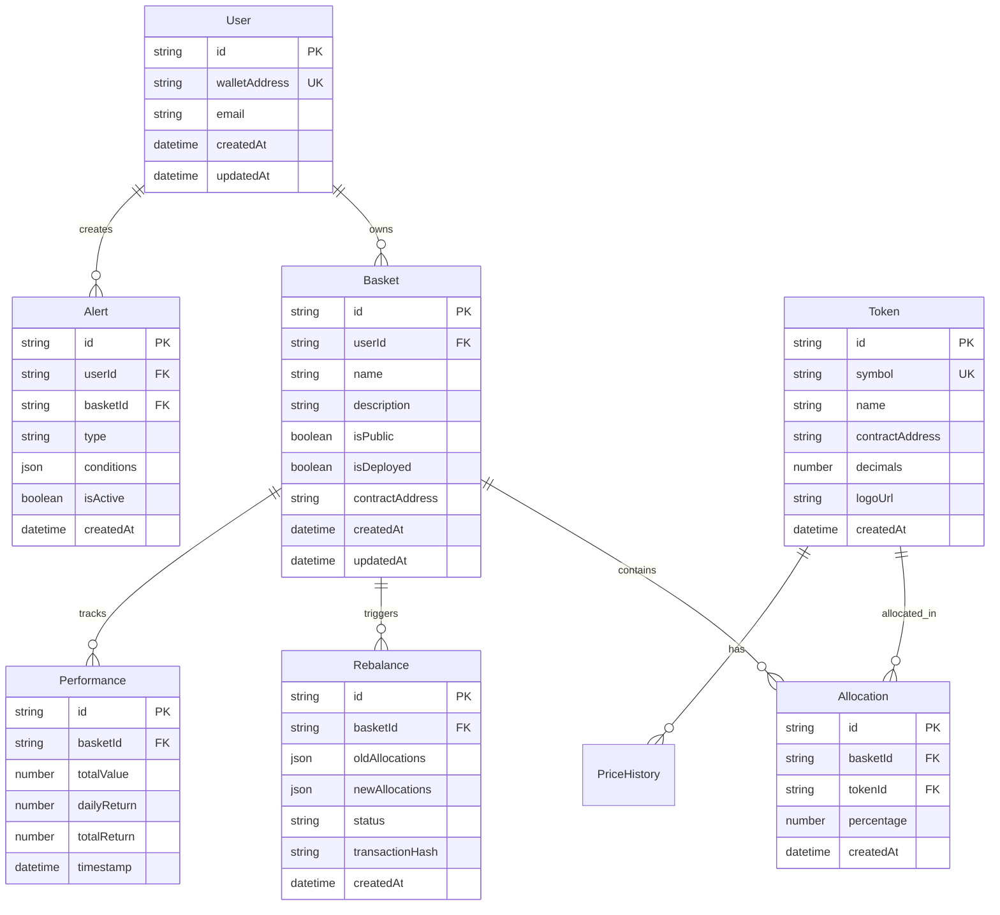

# Hackathon Roadmap Design Document

## Overview

This design document outlines the complete monorepo structure and 4-week hackathon roadmap for Basket.fi, providing a minimal but runnable foundation that can be rapidly developed into a full-featured DeFi portfolio management platform.

## Architecture

### Monorepo Structure

```
basket-fi/
├── README.md                           # Main project documentation
├── package.json                        # Root package configuration
├── pnpm-workspace.yaml                 # pnpm workspace configuration
├── turbo.json                          # Turborepo pipeline configuration
├── .env.example                        # Environment variables template
├── .gitignore                          # Git ignore rules
├── .eslintrc.js                        # Root ESLint configuration
├── .prettierrc                         # Prettier configuration
├── docker-compose.yml                  # Local development services
├── Makefile                            # Development commands
│
├── apps/
│   ├── backend/                        # NestJS API server
│   │   ├── README.md
│   │   ├── package.json
│   │   ├── nest-cli.json
│   │   ├── tsconfig.json
│   │   ├── .env.example
│   │   ├── Dockerfile
│   │   ├── prisma/
│   │   │   ├── schema.prisma           # Database schema
│   │   │   ├── seed.ts                 # Database seeding
│   │   │   └── migrations/             # Database migrations
│   │   └── src/
│   │       ├── main.ts                 # Application entry point
│   │       ├── app.module.ts           # Root module
│   │       ├── auth/                   # Authentication module
│   │       │   ├── auth.module.ts
│   │       │   ├── auth.service.ts
│   │       │   ├── auth.controller.ts
│   │       │   └── strategies/
│   │       │       └── jwt.strategy.ts
│   │       ├── baskets/                # Basket management
│   │       │   ├── baskets.module.ts
│   │       │   ├── baskets.service.ts
│   │       │   ├── baskets.controller.ts
│   │       │   └── dto/
│   │       │       ├── create-basket.dto.ts
│   │       │       └── update-basket.dto.ts
│   │       ├── tokens/                 # Token data management
│   │       │   ├── tokens.module.ts
│   │       │   ├── tokens.service.ts
│   │       │   └── tokens.controller.ts
│   │       ├── rebalance/              # Rebalancing logic
│   │       │   ├── rebalance.module.ts
│   │       │   ├── rebalance.service.ts
│   │       │   └── rebalance.controller.ts
│   │       ├── analytics/              # Performance analytics
│   │       │   ├── analytics.module.ts
│   │       │   ├── analytics.service.ts
│   │       │   └── analytics.controller.ts
│   │       ├── notifications/          # Alert system
│   │       │   ├── notifications.module.ts
│   │       │   ├── notifications.service.ts
│   │       │   └── notifications.controller.ts
│   │       ├── common/                 # Shared utilities
│   │       │   ├── decorators/
│   │       │   ├── filters/
│   │       │   ├── guards/
│   │       │   ├── interceptors/
│   │       │   └── pipes/
│   │       └── config/                 # Configuration
│   │           ├── database.config.ts
│   │           ├── redis.config.ts
│   │           └── app.config.ts
│   │
│   ├── web/                            # Next.js frontend
│   │   ├── README.md
│   │   ├── package.json
│   │   ├── next.config.js
│   │   ├── tailwind.config.js
│   │   ├── tsconfig.json
│   │   ├── .env.example
│   │   ├── Dockerfile
│   │   ├── public/
│   │   │   ├── favicon.ico
│   │   │   ├── logo.svg
│   │   │   └── images/
│   │   └── src/
│   │       ├── app/                    # App Router pages
│   │       │   ├── layout.tsx          # Root layout
│   │       │   ├── page.tsx            # Home page
│   │       │   ├── globals.css         # Global styles
│   │       │   ├── auth/
│   │       │   │   └── page.tsx        # Authentication page
│   │       │   ├── dashboard/
│   │       │   │   └── page.tsx        # User dashboard
│   │       │   ├── baskets/
│   │       │   │   ├── page.tsx        # Basket list
│   │       │   │   ├── create/
│   │       │   │   │   └── page.tsx    # Create basket
│   │       │   │   └── [id]/
│   │       │   │       ├── page.tsx    # Basket details
│   │       │   │       └── rebalance/
│   │       │   │           └── page.tsx # Rebalance page
│   │       │   ├── analytics/
│   │       │   │   └── page.tsx        # Analytics dashboard
│   │       │   └── api/
│   │       │       ├── auth/
│   │       │       └── health/
│   │       │           └── route.ts    # Health check
│   │       ├── components/             # React components
│   │       │   ├── ui/                 # Base UI components
│   │       │   │   ├── button.tsx
│   │       │   │   ├── card.tsx
│   │       │   │   ├── input.tsx
│   │       │   │   ├── dialog.tsx
│   │       │   │   └── toast.tsx
│   │       │   ├── layout/             # Layout components
│   │       │   │   ├── header.tsx
│   │       │   │   ├── sidebar.tsx
│   │       │   │   └── footer.tsx
│   │       │   ├── auth/               # Auth components
│   │       │   │   ├── wallet-connect.tsx
│   │       │   │   └── auth-guard.tsx
│   │       │   ├── baskets/            # Basket components
│   │       │   │   ├── basket-card.tsx
│   │       │   │   ├── basket-form.tsx
│   │       │   │   ├── allocation-chart.tsx
│   │       │   │   └── rebalance-modal.tsx
│   │       │   ├── analytics/          # Analytics components
│   │       │   │   ├── performance-chart.tsx
│   │       │   │   ├── metrics-card.tsx
│   │       │   │   └── comparison-table.tsx
│   │       │   └── common/             # Common components
│   │       │       ├── loading.tsx
│   │       │       ├── error-boundary.tsx
│   │       │       └── confirmation-modal.tsx
│   │       ├── hooks/                  # Custom React hooks
│   │       │   ├── use-auth.ts
│   │       │   ├── use-baskets.ts
│   │       │   ├── use-tokens.ts
│   │       │   ├── use-analytics.ts
│   │       │   └── use-notifications.ts
│   │       ├── lib/                    # Utility libraries
│   │       │   ├── api-client.ts       # API client configuration
│   │       │   ├── wallet-config.ts    # Wallet connection setup
│   │       │   ├── query-client.ts     # React Query setup
│   │       │   ├── utils.ts            # General utilities
│   │       │   └── constants.ts        # App constants
│   │       ├── providers/              # Context providers
│   │       │   ├── wallet-provider.tsx
│   │       │   ├── query-provider.tsx
│   │       │   ├── theme-provider.tsx
│   │       │   └── notification-provider.tsx
│   │       ├── styles/                 # Styling
│   │       │   ├── globals.css
│   │       │   └── components.css
│   │       └── types/                  # Frontend-specific types
│   │           ├── api.ts
│   │           ├── wallet.ts
│   │           └── components.ts
│   │
│   └── mobile/                         # React Native mobile app
│       ├── README.md
│       ├── package.json
│       ├── app.json
│       ├── babel.config.js
│       ├── metro.config.js
│       ├── tsconfig.json
│       ├── .env.example
│       ├── app/                        # Expo Router pages
│       │   ├── _layout.tsx             # Root layout
│       │   ├── index.tsx               # Home screen
│       │   ├── (auth)/
│       │   │   ├── _layout.tsx
│       │   │   └── welcome.tsx         # Welcome/auth screen
│       │   ├── (tabs)/
│       │   │   ├── _layout.tsx         # Tab navigation
│       │   │   ├── index.tsx           # Dashboard tab
│       │   │   ├── baskets.tsx         # Baskets tab
│       │   │   ├── analytics.tsx       # Analytics tab
│       │   │   └── profile.tsx         # Profile tab
│       │   └── baskets/
│       │       ├── create.tsx          # Create basket
│       │       └── [id].tsx            # Basket details
│       ├── components/                 # Mobile components
│       │   ├── ui/                     # Base components
│       │   ├── auth/                   # Auth components
│       │   ├── baskets/                # Basket components
│       │   └── common/                 # Common components
│       ├── hooks/                      # Mobile hooks
│       ├── lib/                        # Mobile utilities
│       ├── providers/                  # Mobile providers
│       └── types/                      # Mobile types
│
├── packages/
│   ├── types/                          # Shared TypeScript types
│   │   ├── README.md
│   │   ├── package.json
│   │   ├── tsconfig.json
│   │   └── src/
│   │       ├── index.ts                # Main exports
│   │       ├── user.ts                 # User types
│   │       ├── basket.ts               # Basket types
│   │       ├── token.ts                # Token types
│   │       ├── analytics.ts            # Analytics types
│   │       ├── api.ts                  # API types
│   │       └── common.ts               # Common types
│   │
│   ├── ui/                             # Shared UI components
│   │   ├── README.md
│   │   ├── package.json
│   │   ├── tsconfig.json
│   │   ├── tailwind.config.js
│   │   └── src/
│   │       ├── index.ts                # Component exports
│   │       ├── button.tsx              # Button component
│   │       ├── card.tsx                # Card component
│   │       ├── input.tsx               # Input component
│   │       ├── dialog.tsx              # Dialog component
│   │       ├── toast.tsx               # Toast component
│   │       ├── chart.tsx               # Chart component
│   │       └── styles/
│   │           └── globals.css         # Component styles
│   │
│   ├── utils/                          # Shared utilities
│   │   ├── README.md
│   │   ├── package.json
│   │   ├── tsconfig.json
│   │   └── src/
│   │       ├── index.ts                # Utility exports
│   │       ├── format.ts               # Formatting utilities
│   │       ├── validation.ts           # Validation utilities
│   │       ├── calculations.ts         # Financial calculations
│   │       ├── constants.ts            # Shared constants
│   │       └── cn.ts                   # Class name utility
│   │
│   └── config/                         # Shared configurations
│       ├── README.md
│       ├── package.json
│       ├── eslint/
│       │   ├── base.js                 # Base ESLint config
│       │   ├── nextjs.js               # Next.js ESLint config
│       │   ├── nestjs.js               # NestJS ESLint config
│       │   └── react-native.js         # React Native ESLint config
│       ├── prettier/
│       │   └── index.js                # Prettier configuration
│       └── typescript/
│           ├── base.json               # Base TypeScript config
│           ├── nextjs.json             # Next.js TypeScript config
│           ├── nestjs.json             # NestJS TypeScript config
│           └── react-native.json       # React Native TypeScript config
│
├── tools/                              # Development tools
│   ├── scripts/                        # Build and deployment scripts
│   │   ├── build.sh                    # Build script
│   │   ├── deploy.sh                   # Deployment script
│   │   ├── seed-db.ts                  # Database seeding
│   │   └── generate-types.ts           # Type generation
│   ├── docker/                         # Docker configurations
│   │   ├── postgres/
│   │   │   └── init.sql                # Database initialization
│   │   └── redis/
│   │       └── redis.conf              # Redis configuration
│   └── github/                         # GitHub workflows
│       └── workflows/
│           ├── ci.yml                  # Continuous integration
│           ├── deploy.yml              # Deployment workflow
│           └── release.yml             # Release workflow
│
├── docs/                               # Documentation
│   ├── README.md                       # Documentation index
│   ├── CONTRIBUTING.md                 # Contribution guidelines
│   ├── DEPLOYMENT.md                   # Deployment guide
│   ├── API.md                          # API documentation
│   ├── ARCHITECTURE.md                 # Architecture overview
│   ├── DEMO_SCRIPT.md                  # Demo presentation script
│   └── assets/                         # Documentation assets
│       ├── architecture-diagram.png
│       ├── user-flow-diagram.png
│       └── screenshots/
│
└── .github/                            # GitHub configuration
    ├── ISSUE_TEMPLATE/                 # Issue templates
    ├── PULL_REQUEST_TEMPLATE.md        # PR template
    └── workflows/                      # GitHub Actions
        ├── ci.yml                      # CI workflow
        ├── deploy-staging.yml          # Staging deployment
        └── deploy-production.yml       # Production deployment
```

## Components and Interfaces

### Core Application Flow



### Technology Stack Integration

#### Backend Architecture
- **Framework**: NestJS with Express
- **Database**: PostgreSQL with Prisma ORM
- **Cache**: Redis for session and data caching
- **Authentication**: JWT with Web3 wallet verification
- **API Documentation**: Swagger/OpenAPI integration

#### Frontend Architecture
- **Web**: Next.js 14 with App Router
- **Mobile**: Expo with React Native
- **State Management**: TanStack Query for server state
- **Styling**: Tailwind CSS with custom design system
- **Web3**: Wagmi v2 + Viem + RainbowKit

#### Shared Packages
- **Types**: Zod schemas with TypeScript definitions
- **UI**: Reusable components with Tailwind
- **Utils**: Common utilities and calculations
- **Config**: Shared ESLint, Prettier, TypeScript configs

## Data Models

### Core Entity Relationships



### API Response Schemas

```typescript
// Standardized API response format
interface ApiResponse<T> {
  data: T;
  message: string;
  status: 'success' | 'error';
  timestamp: string;
}

// Basket creation request
interface CreateBasketRequest {
  name: string;
  description?: string;
  allocations: {
    tokenId: string;
    percentage: number;
  }[];
  isPublic: boolean;
}

// Performance analytics response
interface PerformanceAnalytics {
  basketId: string;
  timeframe: '1d' | '7d' | '30d' | '90d' | '1y';
  metrics: {
    totalReturn: number;
    volatility: number;
    sharpeRatio: number;
    maxDrawdown: number;
  };
  chartData: {
    timestamp: string;
    value: number;
  }[];
}
```

## Error Handling

### Comprehensive Error Management

#### API Error Responses
```typescript
interface ApiError {
  code: string;
  message: string;
  details?: Record<string, any>;
  timestamp: string;
  path: string;
}

// Common error codes
enum ErrorCodes {
  VALIDATION_ERROR = 'VALIDATION_ERROR',
  AUTHENTICATION_ERROR = 'AUTHENTICATION_ERROR',
  AUTHORIZATION_ERROR = 'AUTHORIZATION_ERROR',
  RESOURCE_NOT_FOUND = 'RESOURCE_NOT_FOUND',
  BLOCKCHAIN_ERROR = 'BLOCKCHAIN_ERROR',
  EXTERNAL_API_ERROR = 'EXTERNAL_API_ERROR',
  RATE_LIMIT_EXCEEDED = 'RATE_LIMIT_EXCEEDED'
}
```

#### Frontend Error Boundaries
- Global error boundary for unhandled exceptions
- Component-level error boundaries for isolated failures
- Toast notifications for user-friendly error messages
- Retry mechanisms for transient failures

#### Blockchain Error Handling
- Transaction failure recovery
- Network switching prompts
- Gas estimation and adjustment
- Wallet connection error handling

## Testing Strategy

### Minimal Testing Approach for Hackathon

#### Unit Tests (Essential Only)
- Core business logic functions
- Utility functions and calculations
- Critical API endpoints

#### Integration Tests (Key Flows)
- Authentication flow
- Basket creation and management
- Rebalancing logic
- External API integrations

#### End-to-End Tests (Demo Scenarios)
- Complete user onboarding
- Basket creation to rebalancing flow
- Analytics dashboard functionality

### Testing Configuration
```typescript
// Jest configuration for backend
export default {
  preset: 'ts-jest',
  testEnvironment: 'node',
  roots: ['<rootDir>/src'],
  testMatch: ['**/__tests__/**/*.ts', '**/?(*.)+(spec|test).ts'],
  collectCoverageFrom: [
    'src/**/*.ts',
    '!src/**/*.d.ts',
    '!src/main.ts'
  ]
};

// Vitest configuration for frontend
export default defineConfig({
  test: {
    environment: 'jsdom',
    setupFiles: ['./src/test/setup.ts'],
    globals: true
  }
});
```