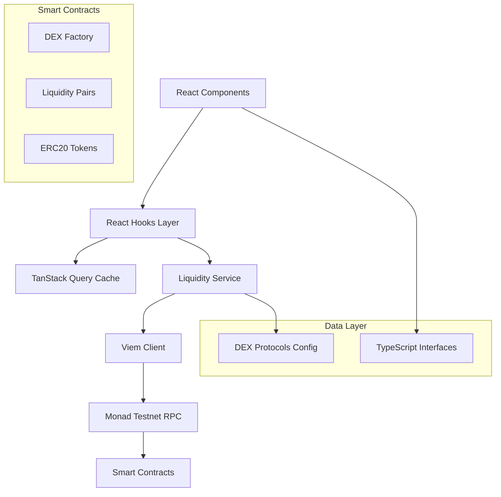

# Design Document

## Overview

The Monad Testnet Liquidity Pools Integration provides a comprehensive solution for exploring, analyzing, and interacting with decentralized exchange (DEX) liquidity pools on the Monad blockchain testnet. The system follows a layered architecture pattern with clear separation of concerns between blockchain interaction, data management, and user interface components.

The design leverages existing Web3 infrastructure (Viem, TanStack Query) and follows React best practices to deliver a responsive, reliable, and extensible liquidity pool explorer that serves as the foundation for advanced DeFi features in Basket.fi.

## Architecture

### High-Level Architecture



### Layer Responsibilities

1. **UI Layer**: React components for user interaction and data presentation
2. **Hooks Layer**: Custom React hooks for state management and data fetching
3. **Service Layer**: Business logic and blockchain interaction abstraction
4. **Transport Layer**: Viem client for blockchain communication
5. **Configuration Layer**: DEX protocol definitions and token mappings

## Components and Interfaces

### Core Data Structures

#### DEXProtocol Interface
```typescript
interface DEXProtocol {
  name: string;                    // Human-readable DEX name
  website: string;                 // Official website URL
  factoryAddress?: string;         // Factory contract address
  routerAddress?: string;          // Router contract address (future use)
  subgraphUrl?: string;           // The Graph subgraph URL (future use)
  apiUrl?: string;                // REST API endpoint (future use)
  isActive: boolean;              // Enable/disable flag
}
```

#### LiquidityPool Interface
```typescript
interface LiquidityPool {
  address: string;                // Pool contract address
  token0: TokenInfo;              // First token details
  token1: TokenInfo;              // Second token details
  reserve0: string;               // Token0 reserves (BigInt as string)
  reserve1: string;               // Token1 reserves (BigInt as string)
  totalSupply: string;            // LP token total supply
  fee: number;                    // Fee in basis points
  protocol: string;               // Source DEX protocol name
}
```

### Service Architecture

#### LiquidityService Class

**Purpose**: Centralized blockchain interaction and data processing

**Key Methods**:
- `findLiquidityPools(tokenA, tokenB)`: Search pools by token pair
- `getAllPools(protocolName?)`: Retrieve all pools from specified or all DEX protocols
- `getPoolData(pairAddress, protocolName)`: Fetch detailed pool information
- `calculatePriceImpact(inputAmount, inputReserve, outputReserve)`: Calculate trade impact

**Design Patterns**:
- Singleton pattern for service instance
- Promise-based async operations
- Error isolation per protocol
- Concurrent processing for multiple DEX queries

#### Blockchain Interaction Strategy

**Contract ABIs**:
- Factory ABI: Pool discovery and creation tracking
- Pair ABI: Reserve data and token information
- ERC20 ABI: Token metadata (symbol, decimals)

**Error Handling**:
- Protocol-level error isolation
- Graceful degradation when DEX protocols fail
- Retry logic with exponential backoff
- User-friendly error messages

### React Hooks Architecture

#### useLiquidityPools Hook
```typescript
function useLiquidityPools(protocolName?: string) {
  // TanStack Query configuration
  // Automatic refetching and caching
  // Loading and error state management
}
```

#### useFindPools Hook
```typescript
function useFindPools(tokenA?: string, tokenB?: string) {
  // Conditional query execution
  // Search-specific caching strategy
  // Input validation and sanitization
}
```

#### usePoolData Hook
```typescript
function usePoolData(pools: LiquidityPool[]) {
  // Client-side data processing
  // TVL calculation (when price oracle available)
  // Pool ranking and filtering
}
```

### UI Component Structure

#### PoolsExplorer Component

**Features**:
- Protocol filtering dropdown
- Token pair search interface
- Pool listing with sorting options
- Statistics dashboard
- Responsive design for mobile/desktop

**State Management**:
- Local state for UI interactions
- Query state through React hooks
- Derived state for computed values

## Data Models

### Configuration Data

#### DEX Protocol Configuration
```typescript
const MONAD_TESTNET_DEX_PROTOCOLS: DEXProtocol[] = [
  {
    name: 'MonadSwap',
    website: 'https://monadswap.xyz',
    factoryAddress: '0x...', // To be populated with actual addresses
    routerAddress: '0x...',
    isActive: true,
  },
  // Additional protocols as they become available
];
```

#### Token Registry
```typescript
const MONAD_TESTNET_TOKENS = {
  WMON: '0x...', // Wrapped MON
  USDC: '0x...', // USD Coin testnet
  USDT: '0x...', // Tether testnet
  WETH: '0x...', // Wrapped Ethereum testnet
  DAI: '0x...',  // DAI testnet
} as const;
```

### Runtime Data Models

#### Pool Discovery Flow
1. Query factory contracts for all pairs
2. Batch process pair addresses
3. Fetch detailed pool data concurrently
4. Aggregate results across protocols
5. Cache results with appropriate TTL

#### Search Flow
1. Validate token addresses
2. Query each active DEX factory
3. Filter non-zero pool addresses
4. Fetch pool details
5. Sort by liquidity depth

## Error Handling

### Error Categories

1. **Network Errors**: RPC connectivity issues
2. **Contract Errors**: Invalid addresses or ABI mismatches
3. **Data Errors**: Malformed responses or missing data
4. **Validation Errors**: Invalid user inputs

### Error Handling Strategy

#### Service Level
```typescript
try {
  const pairAddress = await factory.read.getPair([tokenA, tokenB]);
  // Process successful response
} catch (error) {
  console.warn(`Failed to fetch pool from ${protocol.name}:`, error);
  // Continue with other protocols
}
```

#### Hook Level
```typescript
const { data, error, isLoading, retry } = useQuery({
  queryKey: ['liquidity-pools'],
  queryFn: () => liquidityService.getAllPools(),
  retry: 3,
  retryDelay: (attemptIndex) => Math.min(1000 * 2 ** attemptIndex, 30000),
});
```

#### UI Level
- Loading states with progress indicators
- Error boundaries for component isolation
- User-friendly error messages with action suggestions
- Retry mechanisms for failed operations

### Resilience Patterns

1. **Circuit Breaker**: Disable failing DEX protocols temporarily
2. **Fallback**: Continue operation with available protocols
3. **Timeout**: Prevent hanging requests
4. **Retry**: Exponential backoff for transient failures

## Testing Strategy

### Unit Testing

#### Service Layer Tests
- Mock blockchain responses
- Test error handling scenarios
- Validate data transformation logic
- Test concurrent operation handling

#### Hook Tests
- Mock service responses
- Test loading states
- Test error conditions
- Test cache behavior

#### Component Tests
- Mock hook responses
- Test user interactions
- Test responsive behavior
- Test accessibility features

### Integration Testing

#### Blockchain Integration
- Test against Monad Testnet
- Validate contract interactions
- Test with real pool data
- Performance testing with large datasets

#### End-to-End Testing
- Complete user workflows
- Cross-browser compatibility
- Mobile responsiveness
- Error recovery scenarios

### Test Data Strategy

#### Mock Data
- Representative pool structures
- Various token combinations
- Error response scenarios
- Edge cases (empty pools, large numbers)

#### Testnet Data
- Real contract addresses
- Live pool interactions
- Network condition variations
- Protocol availability changes

## Performance Considerations

### Caching Strategy

#### Query Cache Configuration
```typescript
{
  staleTime: 30000,      // 30 seconds freshness
  refetchInterval: 60000, // 1 minute auto-refresh
  cacheTime: 300000,     // 5 minutes cache retention
}
```

#### Data Freshness
- Real-time updates for active trading pairs
- Periodic refresh for background data
- Manual refresh capability
- Cache invalidation on user actions

### Optimization Techniques

1. **Batch Processing**: Group contract calls to reduce RPC requests
2. **Concurrent Queries**: Parallel DEX protocol queries
3. **Lazy Loading**: Load pool details on demand
4. **Pagination**: Handle large pool lists efficiently
5. **Memoization**: Cache computed values in React components

### Scalability Considerations

#### Protocol Scaling
- Dynamic protocol registration
- Load balancing across RPC endpoints
- Rate limiting for API calls
- Graceful degradation under load

#### Data Volume Scaling
- Efficient data structures
- Memory usage optimization
- Background data processing
- Progressive loading strategies

## Security Considerations

### Input Validation
- Token address format validation
- Contract address verification
- Parameter sanitization
- XSS prevention in user inputs

### Blockchain Security
- Read-only operations (no wallet connections required)
- Contract address verification
- ABI validation
- RPC endpoint security

### Data Privacy
- No personal data collection
- Public blockchain data only
- Transparent data usage
- GDPR compliance considerations

## Future Extensibility

### Planned Enhancements

1. **Price Oracle Integration**: Real-time token pricing for TVL calculation
2. **Historical Data**: Pool performance tracking over time
3. **Advanced Analytics**: Yield farming opportunities, impermanent loss calculations
4. **Multi-Chain Support**: Extend to other EVM-compatible chains
5. **Trading Integration**: Direct swap functionality through DEX routers

### Architecture Flexibility

#### Plugin System
- Modular DEX protocol adapters
- Configurable data sources
- Extensible UI components
- Custom analytics modules

#### API Design
- RESTful endpoints for external integrations
- GraphQL support for complex queries
- WebSocket connections for real-time updates
- Rate limiting and authentication

### Migration Strategy

#### Version Management
- Backward compatibility for configuration changes
- Graceful migration for breaking changes
- Feature flags for gradual rollouts
- Rollback capabilities for failed deployments

## Deployment Considerations

### Environment Configuration
- Testnet vs Mainnet configurations
- RPC endpoint management
- Feature flag management
- Performance monitoring setup

### Monitoring and Observability
- Error tracking and alerting
- Performance metrics collection
- User behavior analytics
- System health monitoring

### Maintenance Strategy
- Automated testing pipelines
- Continuous integration/deployment
- Configuration management
- Documentation maintenance