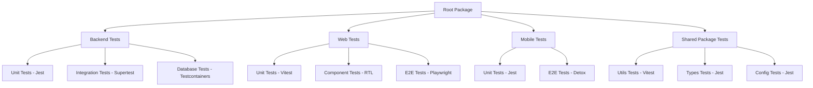

# Testing Strategy Design Document

## Overview

This design document outlines the comprehensive testing architecture for the Basket.fi monorepo, implementing a pragmatic testing pyramid that balances thorough coverage with development velocity. The strategy leverages modern testing tools and practices to ensure code quality, reliability, and maintainability across all applications and packages.

The testing strategy follows a layered approach:
- **Unit Tests (70% of tests)**: Fast, isolated tests for business logic
- **Integration Tests (20% of tests)**: API and database interaction tests
- **End-to-End Tests (10% of tests)**: Critical user journey validation

## Architecture

### Testing Framework Selection

#### Backend Testing Stack
- **Primary Framework**: Jest with ts-jest for TypeScript support
- **API Testing**: Supertest for HTTP endpoint testing
- **Database Testing**: Test containers with PostgreSQL
- **Mocking**: Jest built-in mocking capabilities
- **Coverage**: Istanbul via Jest

#### Frontend Testing Stack
- **Web Application**: Vitest for unit/integration tests, Playwright for E2E
- **Mobile Application**: Jest for unit tests, Detox for E2E (optional)
- **Component Testing**: React Testing Library
- **Visual Testing**: Playwright screenshots for regression detection

#### Shared Package Testing
- **Utility Functions**: Vitest for fast execution
- **Type Validation**: Zod schema testing
- **Configuration**: Jest for config validation

### Monorepo Testing Configuration



## Components and Interfaces

### Test Configuration Structure

```
basket-fi/
├── jest.config.js                 # Root Jest configuration
├── playwright.config.ts           # E2E test configuration
├── vitest.config.ts               # Shared Vitest configuration
├── apps/
│   ├── backend/
│   │   ├── jest.config.js         # Backend-specific Jest config
│   │   ├── test/
│   │   │   ├── unit/              # Unit tests
│   │   │   ├── integration/       # Integration tests
│   │   │   └── fixtures/          # Test data and helpers
│   │   └── src/
│   │       └── **/*.spec.ts       # Co-located unit tests
│   ├── web/
│   │   ├── vitest.config.ts       # Web-specific Vitest config
│   │   ├── playwright.config.ts   # Web E2E configuration
│   │   ├── tests/
│   │   │   ├── unit/              # Unit tests
│   │   │   ├── integration/       # Integration tests
│   │   │   └── e2e/               # End-to-end tests
│   │   └── src/
│   │       └── **/*.test.tsx      # Co-located component tests
│   └── mobile/
│       ├── jest.config.js         # Mobile-specific Jest config
│       ├── detox.config.js        # Mobile E2E configuration
│       ├── __tests__/             # Test files
│       └── e2e/                   # End-to-end tests
├── packages/
│   ├── types/
│   │   ├── vitest.config.ts       # Types package testing
│   │   └── src/
│   │       └── **/*.test.ts       # Schema validation tests
│   ├── utils/
│   │   ├── vitest.config.ts       # Utils package testing
│   │   └── src/
│   │       └── **/*.test.ts       # Utility function tests
│   └── ui/
│       ├── vitest.config.ts       # UI package testing
│       └── src/
│           └── **/*.test.tsx      # Component tests
└── tools/
    ├── test-setup/                # Shared test utilities
    ├── fixtures/                  # Common test data
    └── docker/                    # Test container configurations
```

### Test Environment Management

#### Database Testing Strategy
- **Test Containers**: Isolated PostgreSQL instances for integration tests
- **Transaction Rollback**: Each test runs in a transaction that's rolled back
- **Seed Data**: Consistent test data setup via Prisma seed scripts
- **Schema Validation**: Automated testing of database migrations

#### External Service Mocking
- **API Mocking**: MSW (Mock Service Worker) for external API calls
- **Web3 Mocking**: Mock wallet providers and blockchain interactions
- **Price Feed Mocking**: Consistent mock data for CoinGecko/1inch APIs

### Coverage and Quality Gates

#### Coverage Thresholds
```typescript
// jest.config.js coverage configuration
coverageThreshold: {
  global: {
    branches: 70,
    functions: 70,
    lines: 70,
    statements: 70
  },
  './src/services/': {
    branches: 80,
    functions: 80,
    lines: 80,
    statements: 80
  }
}
```

#### Quality Metrics
- **Test Performance**: Maximum 30s for full test suite
- **Flaky Test Detection**: Automatic retry and reporting
- **Test Maintenance**: Regular cleanup of obsolete tests

## Data Models

### Test Data Management

#### Fixture Structure
```typescript
// Test fixture interface
interface TestFixture {
  users: {
    authenticated: User;
    unauthenticated: User;
    admin: User;
  };
  baskets: {
    public: Basket[];
    private: Basket[];
    empty: Basket;
  };
  tokens: {
    ethereum: Token[];
    testnet: Token[];
  };
}
```

#### Test Database Schema
- **Isolated Test DB**: Separate database for each test suite
- **Migration Testing**: Automated validation of schema changes
- **Data Seeding**: Consistent test data across environments

### Mock Data Patterns

#### API Response Mocks
```typescript
// Standardized mock response structure
interface MockApiResponse<T> {
  data: T;
  status: number;
  headers: Record<string, string>;
  timestamp: string;
}
```

#### Blockchain Mock Data
```typescript
// Web3 interaction mocks
interface MockWeb3Data {
  walletAddress: string;
  chainId: number;
  balance: string;
  transactions: MockTransaction[];
}
```

## Error Handling

### Test Failure Management

#### Categorized Error Handling
1. **Assertion Failures**: Clear error messages with context
2. **Timeout Errors**: Configurable timeouts per test type
3. **Setup/Teardown Errors**: Proper cleanup on test failures
4. **Flaky Test Detection**: Automatic retry with failure analysis

#### Error Reporting Strategy
```typescript
// Custom error reporter for better debugging
class TestErrorReporter {
  reportAssertion(error: AssertionError): void;
  reportTimeout(test: TestCase, duration: number): void;
  reportSetupFailure(suite: TestSuite, error: Error): void;
  generateReport(): TestReport;
}
```

### Debugging Support

#### Test Debugging Tools
- **Debug Mode**: Environment variable to enable verbose logging
- **Screenshot Capture**: Automatic screenshots on E2E test failures
- **Network Logging**: HTTP request/response logging for integration tests
- **Performance Profiling**: Test execution time tracking

## Testing Strategy

### Unit Testing Approach

#### Backend Unit Tests
```typescript
// Example service test structure
describe('BasketService', () => {
  let service: BasketService;
  let mockRepository: jest.Mocked<BasketRepository>;
  
  beforeEach(() => {
    mockRepository = createMockRepository();
    service = new BasketService(mockRepository);
  });
  
  describe('createBasket', () => {
    it('should create basket with valid data', async () => {
      // Test implementation
    });
    
    it('should throw error for invalid allocation', async () => {
      // Test implementation
    });
  });
});
```

#### Frontend Unit Tests
```typescript
// Example component test structure
describe('BasketCard', () => {
  const mockBasket = createMockBasket();
  
  it('should render basket information correctly', () => {
    render(<BasketCard basket={mockBasket} />);
    expect(screen.getByText(mockBasket.name)).toBeInTheDocument();
  });
  
  it('should handle rebalance action', async () => {
    const onRebalance = vi.fn();
    render(<BasketCard basket={mockBasket} onRebalance={onRebalance} />);
    
    await user.click(screen.getByRole('button', { name: /rebalance/i }));
    expect(onRebalance).toHaveBeenCalledWith(mockBasket.id);
  });
});
```

### Integration Testing Approach

#### API Integration Tests
```typescript
// Example API test structure
describe('Baskets API', () => {
  let app: INestApplication;
  let testDb: TestDatabase;
  
  beforeAll(async () => {
    testDb = await createTestDatabase();
    app = await createTestApp(testDb);
  });
  
  describe('POST /baskets', () => {
    it('should create basket with authentication', async () => {
      const basketData = createValidBasketData();
      
      const response = await request(app.getHttpServer())
        .post('/api/v1/baskets')
        .set('Authorization', `Bearer ${authToken}`)
        .send(basketData)
        .expect(201);
        
      expect(response.body).toMatchObject({
        id: expect.any(String),
        name: basketData.name,
        allocations: basketData.allocations
      });
    });
  });
});
```

### End-to-End Testing Approach

#### Critical User Journey Tests
```typescript
// Example E2E test structure
test.describe('Basket Management Flow', () => {
  test('should create, view, and rebalance basket', async ({ page }) => {
    // Authentication
    await page.goto('/auth/welcome');
    await page.click('[data-testid="connect-wallet"]');
    await mockWalletConnection(page);
    
    // Basket creation
    await page.goto('/baskets/create');
    await page.fill('[data-testid="basket-name"]', 'Test Basket');
    await page.click('[data-testid="add-token"]');
    await page.selectOption('[data-testid="token-select"]', 'ETH');
    await page.fill('[data-testid="allocation-input"]', '50');
    await page.click('[data-testid="create-basket"]');
    
    // Verification
    await expect(page.locator('[data-testid="basket-card"]')).toBeVisible();
    await expect(page.locator('text=Test Basket')).toBeVisible();
    
    // Rebalancing
    await page.click('[data-testid="rebalance-button"]');
    await page.click('[data-testid="confirm-rebalance"]');
    await expect(page.locator('[data-testid="rebalance-success"]')).toBeVisible();
  });
});
```

### Performance Testing Strategy

#### Load Testing Configuration
```typescript
// Example performance test setup
interface LoadTestConfig {
  concurrent_users: number;
  test_duration: string;
  ramp_up_time: string;
  endpoints: {
    path: string;
    method: string;
    weight: number;
  }[];
}

const basketApiLoadTest: LoadTestConfig = {
  concurrent_users: 100,
  test_duration: '5m',
  ramp_up_time: '30s',
  endpoints: [
    { path: '/api/v1/baskets', method: 'GET', weight: 60 },
    { path: '/api/v1/baskets', method: 'POST', weight: 20 },
    { path: '/api/v1/baskets/:id/rebalance', method: 'POST', weight: 20 }
  ]
};
```

## Continuous Integration Integration

### GitHub Actions Workflow

#### Test Matrix Strategy
```yaml
# .github/workflows/test.yml structure
strategy:
  matrix:
    node-version: [18.x, 20.x]
    os: [ubuntu-latest, windows-latest, macos-latest]
    test-type: [unit, integration, e2e]
```

#### Parallel Test Execution
- **Unit Tests**: Run in parallel across all packages
- **Integration Tests**: Sequential execution with database isolation
- **E2E Tests**: Parallel execution with different browser contexts

#### Artifact Management
- **Coverage Reports**: Uploaded as GitHub artifacts
- **Test Results**: JUnit XML format for GitHub integration
- **Screenshots**: E2E test failure screenshots
- **Performance Reports**: Load test results and trends

### Quality Gates

#### Pre-merge Requirements
1. **All Tests Pass**: Unit, integration, and E2E tests must pass
2. **Coverage Threshold**: Minimum coverage requirements met
3. **Performance Regression**: No significant performance degradation
4. **Security Scan**: No high-severity vulnerabilities detected

#### Post-merge Monitoring
1. **Test Trend Analysis**: Track test execution time and flakiness
2. **Coverage Tracking**: Monitor coverage changes over time
3. **Performance Monitoring**: Alert on performance regressions
4. **Failure Analysis**: Automated categorization of test failures