# User Flows - Basket.fi Mobile App

## Primary User Flows

### 1. Onboarding & Authentication Flow

#### First-Time User
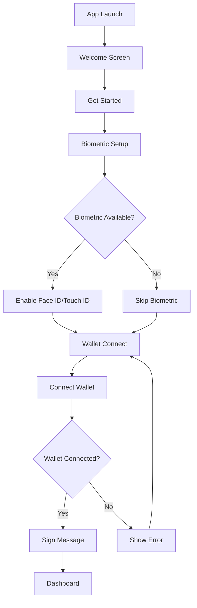

#### Returning User with Biometrics
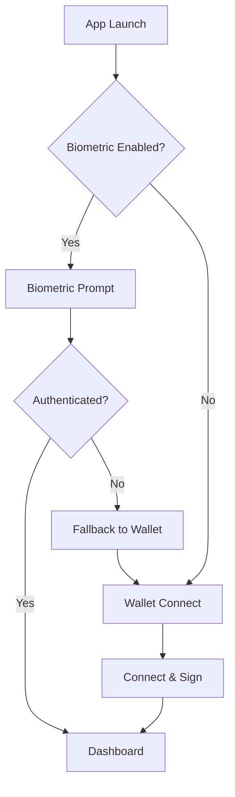

### 2. Portfolio Management Flow

#### View Baskets
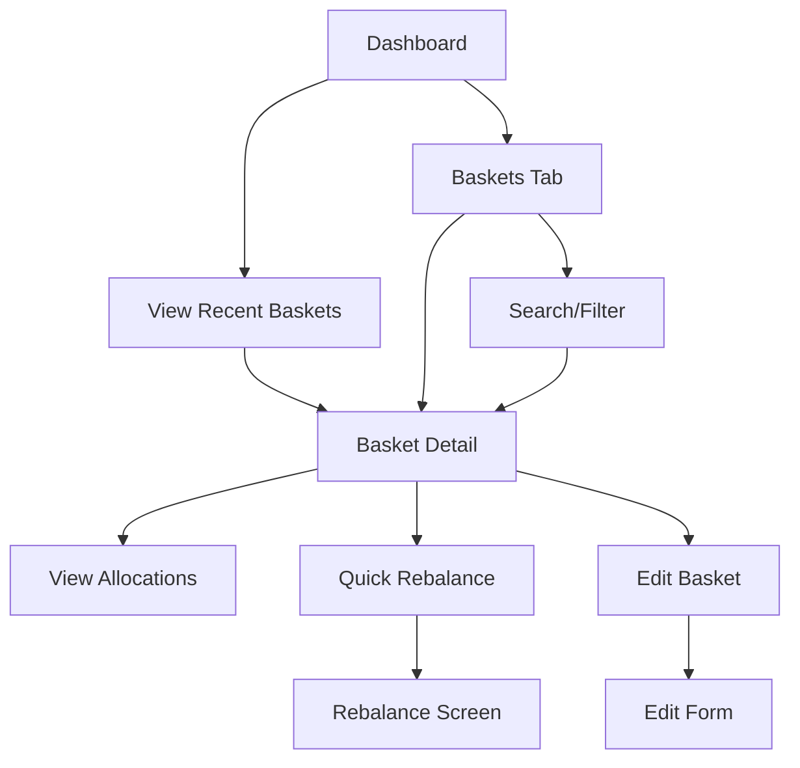

#### Create New Basket
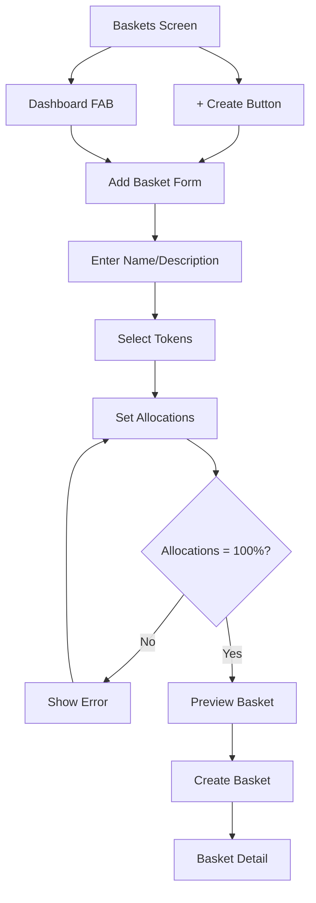

### 3. Quick Rebalance Flow

#### Dry Run Rebalance
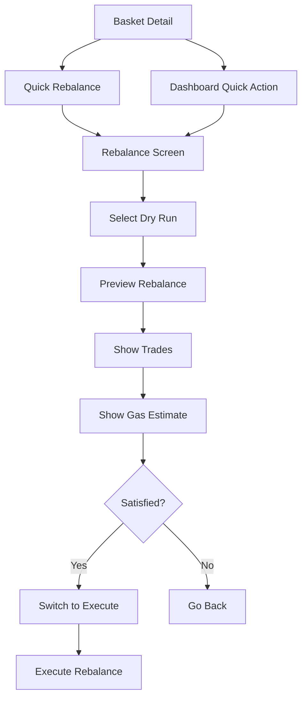

#### Execute Rebalance
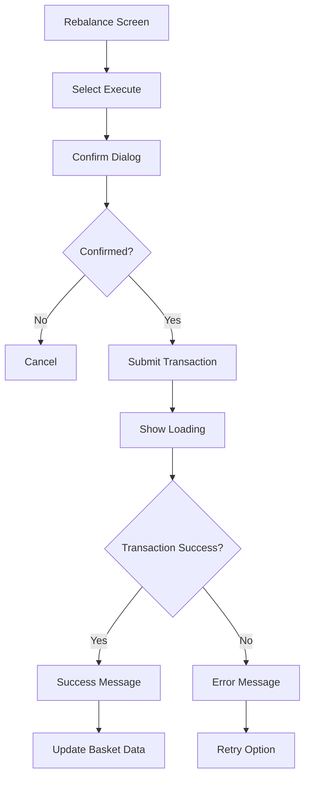

### 4. Alert Management Flow

#### Create Price Alert
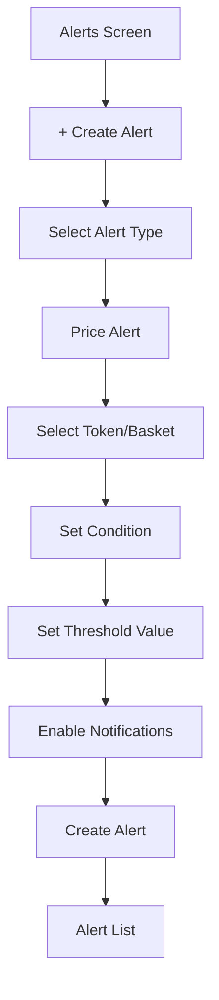

#### Handle Alert Notification
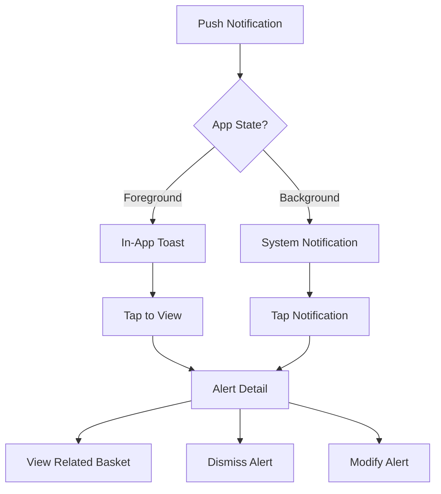

### 5. Error Handling Flows

#### Network Error Recovery
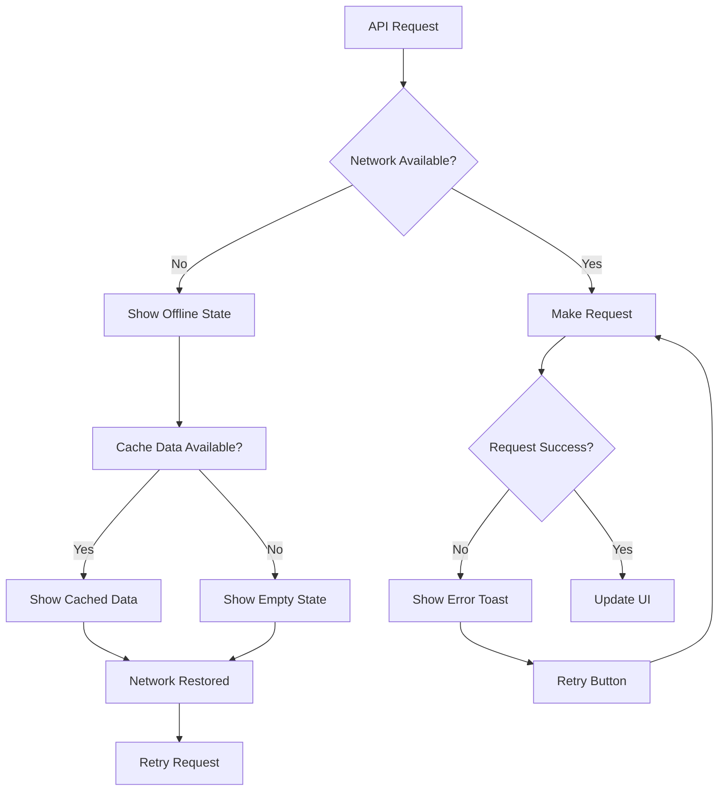

#### Authentication Error Recovery
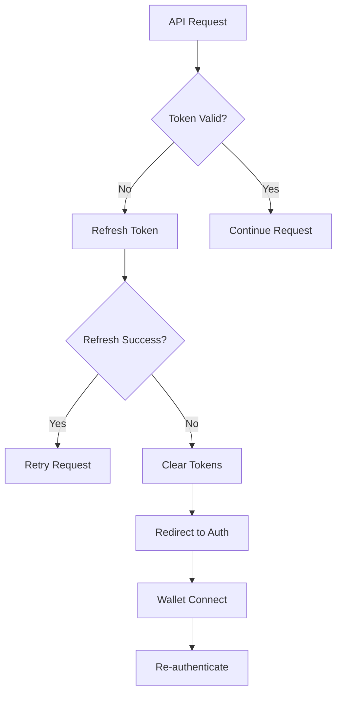

## Secondary Flows

### Deep Link Handling
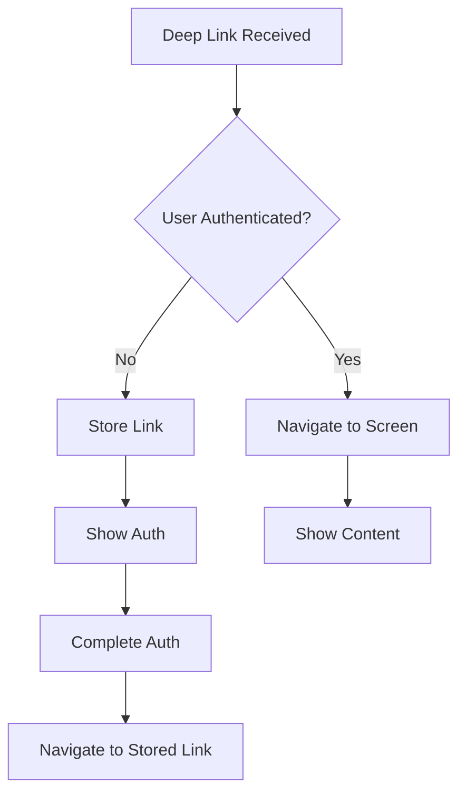

### Background Sync
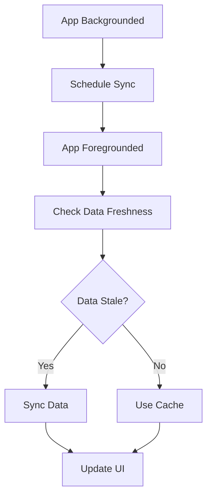

### Biometric Setup
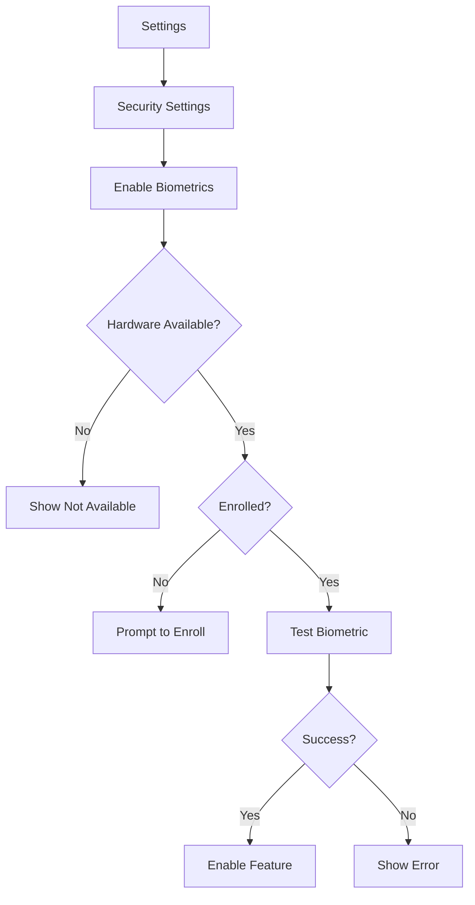

## Edge Cases & Error States

### Wallet Connection Issues
- Wallet app not installed
- User rejects connection
- Network timeout during connection
- Wallet disconnected during session

### Data Synchronization Issues
- Partial data load
- Conflicting local/remote state
- Cache corruption
- Background sync failures

### Performance Edge Cases
- Large basket lists (100+ baskets)
- Complex allocation calculations
- Heavy image loading
- Memory pressure scenarios

## Analytics Tracking Points

### User Journey Tracking
- Screen views and time spent
- Button taps and interactions
- Flow completion rates
- Drop-off points

### Performance Tracking
- Screen load times
- API response times
- Error rates by flow
- Crash reports by screen

### Business Metrics
- Basket creation rate
- Rebalance frequency
- Alert engagement
- Feature adoption rates