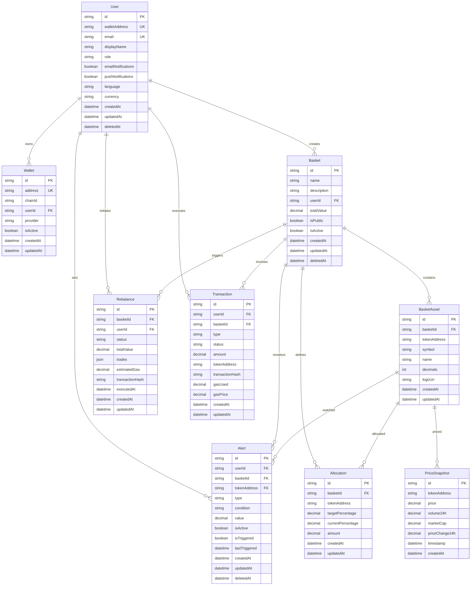

# Entity Relationship Diagram

## Relationship Explanations

### Core Entities
- **User**: Central entity representing platform users with Web3 wallet authentication
- **Wallet**: Multiple wallet addresses per user for different chains/providers
- **Basket**: User-created token portfolios with configurable allocations

### Asset Management
- **BasketAsset**: Tokens included in baskets with metadata
- **Allocation**: Target vs current percentage allocations for each token
- **PriceSnapshot**: Historical price data for portfolio valuation

### Operations
- **Rebalance**: Automated or manual portfolio rebalancing operations
- **Transaction**: On-chain transactions for basket operations
- **Alert**: User-configured notifications for price/allocation changes

### Key Relationships
1. **User → Basket**: One-to-many (users can create multiple baskets)
2. **Basket → Allocation**: One-to-many (each basket has multiple token allocations)
3. **Basket → Rebalance**: One-to-many (baskets can be rebalanced multiple times)
4. **User → Alert**: One-to-many (users can set multiple alerts)
5. **PriceSnapshot**: Independent price data linked to tokens by address