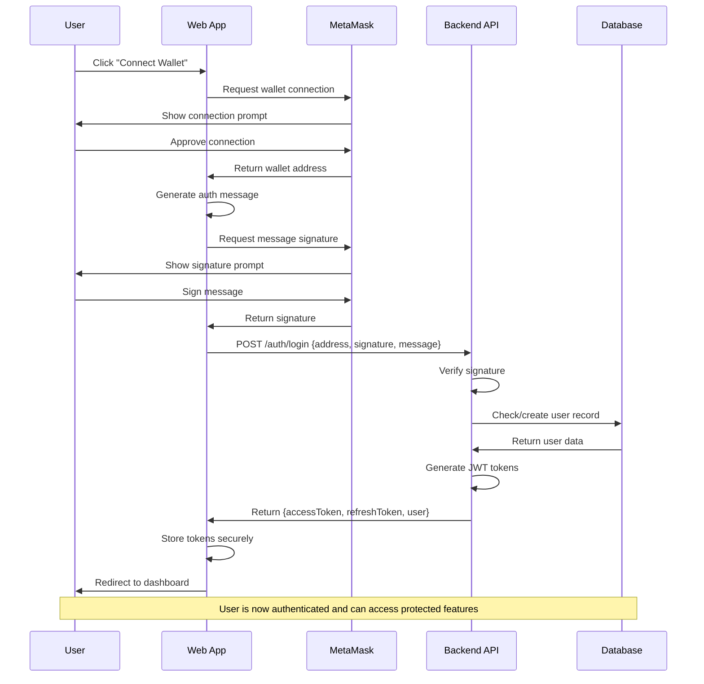
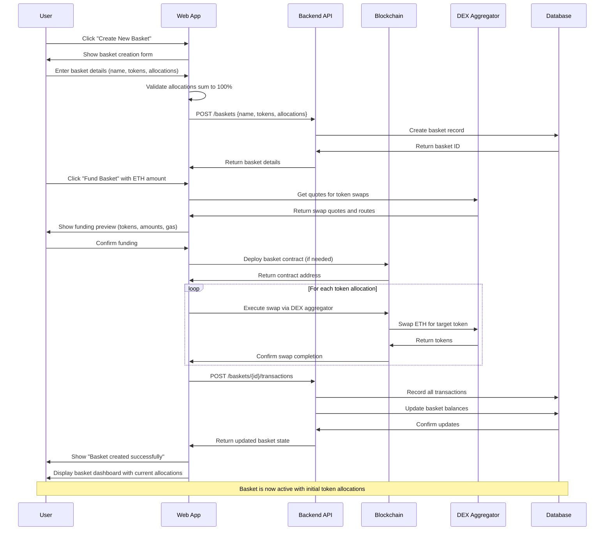
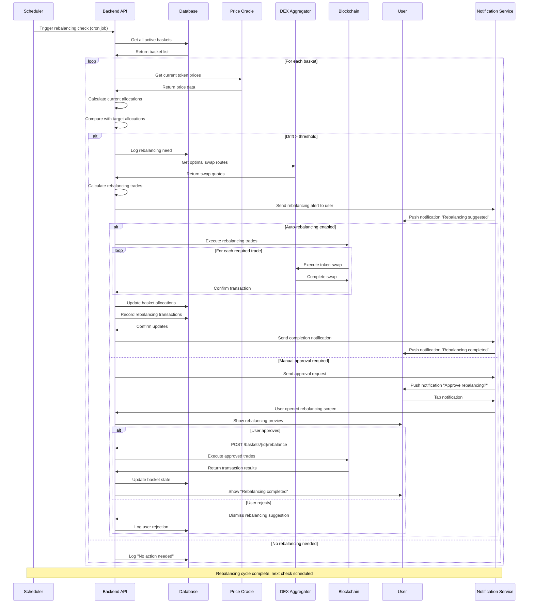
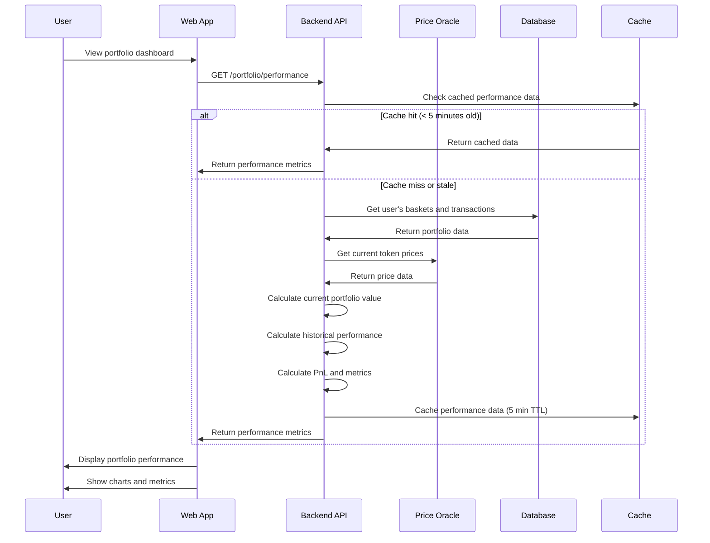
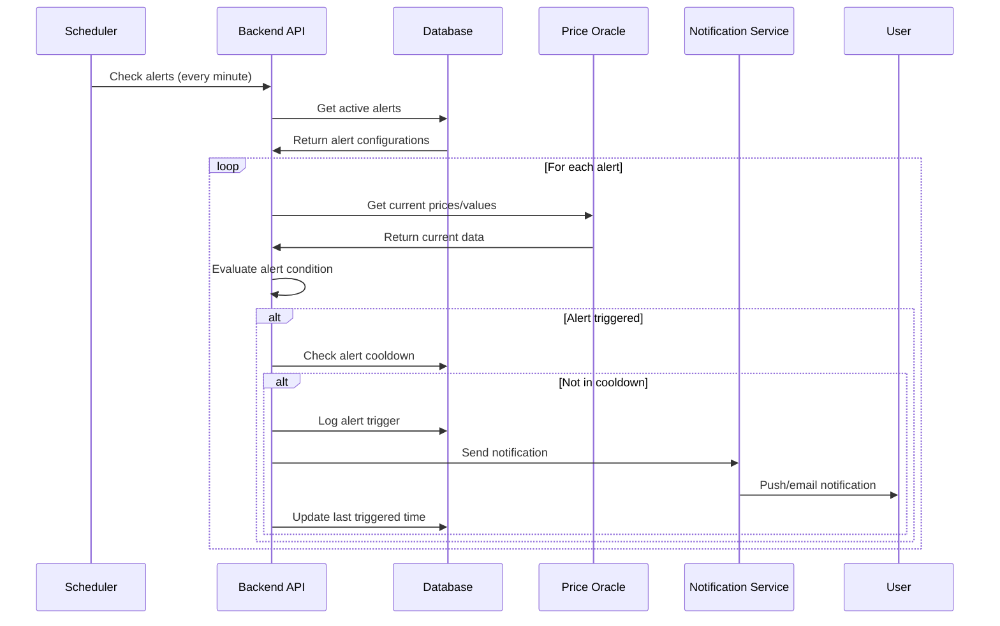

# Basket.fi Sequence Diagrams

## Flow 1: Wallet Connection and Authentication

---

## Flow 2: Create Basket and Initial Deposit

---

## Flow 3: Automated Rebalancing with DEX Integration

---

## Additional Flow Diagrams

### Flow 4: Portfolio Performance Calculation

### Flow 5: Alert System

## Technical Notes

### Authentication Flow
- Uses EIP-712 structured message signing for security
- JWT tokens have 1-hour expiration with refresh capability
- Wallet disconnection clears all local authentication state

### Basket Creation Flow
- Smart contract deployment is optional (can use factory pattern)
- All swaps go through DEX aggregator for best prices
- Transaction batching reduces gas costs significantly

### Rebalancing Flow
- Configurable drift thresholds per basket (default 5%)
- Supports both automatic and manual rebalancing modes
- Uses MEV protection through private mempools when available

### Performance Considerations
- Price data cached for 1-5 minutes depending on volatility
- Portfolio calculations cached to reduce API calls
- WebSocket connections for real-time updates on active pages